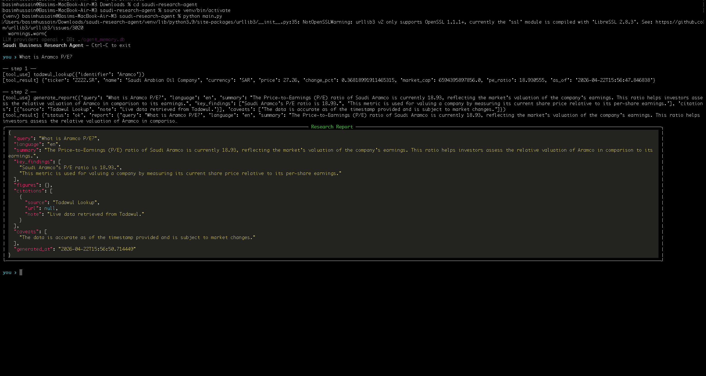

# Saudi Business Research Agent



A simple script that hits a few APIs (Tavily, Yahoo Finance, OpenAI/Claude) to answer questions about Saudi companies and markets. Built to help with quick business research in both English and Arabic.

---

## What it does

- **Web Search**: Uses Tavily to pull recent news and info.
- **Tadawul Quotes**: Fetches live stock prices for Saudi companies using `yfinance`.
- **VAT Calculator**: Simple tool to add or extract the 15% ZATCA VAT.
- **SAMA Rates**: Returns current Saudi Central Bank interest rates.

Saves conversation history to a local SQLite database so you don't lose your chat if you close it.

---

## Quickstart

```bash
# 1. Install dependencies
pip install -r requirements.txt

# 2. Setup your keys
cp .env.example .env
# Edit .env and drop in your OPENAI_API_KEY and TAVILY_API_KEY

# 3. Run it
python main.py                                      # starts chat
python main.py "What is Aramco's current P/E?"      # single question
python main.py "ما هو سعر سهم سابك اليوم؟"           # supports Arabic!
```

### Getting API keys

- **OpenAI**: https://platform.openai.com/ (Or Anthropic if you prefer)
- **Tavily**: https://tavily.com (gives you 1,000 free searches a month)

---

## Example Queries

**1. Stock info and news**
```bash
python main.py "What is Aramco's current P/E and latest earnings news?"
```
*Output snippet:*
```json
{
  "summary": "Saudi Aramco's current P/E ratio is 18.93, with a market cap of approximately 6.59 trillion SAR. Recent earnings news highlights their robust quarterly dividends despite fluctuations in oil prices...",
  "caveats": ["Stock data may be delayed by 15 mins", "Earnings news based on recent web search"]
}
```

**2. Arabic questions**
```bash
python main.py "قارن بين أرامكو وسابك من حيث القيمة السوقية"
```
*Output snippet:*
```json
{
  "summary": "القيمة السوقية لشركة أرامكو السعودية تبلغ حوالي 6.59 تريليون ريال سعودي، بينما تبلغ القيمة السوقية لشركة سابك حوالي 240 مليار ريال سعودي...",
  "caveats": ["تعتمد البيانات على أحدث إغلاق للسوق"]
}
```

**3. VAT Calc**
```bash
python main.py "If I sell a service for 10,000 SAR, what's the VAT-inclusive price?"
```
*Output snippet:*
```json
{
  "summary": "For a net amount of 10,000 SAR, the 15% VAT is 1,500 SAR. The total VAT-inclusive price is 11,500 SAR.",
  "caveats": []
}
```

---

## How it works under the hood

The `main.py` file starts a basic shell. It talks to the LLM, giving it tools like `tadawul_lookup` and `web_search`. The LLM runs whatever tools it needs, gathers the data, and returns a JSON report at the end. History is saved to `agent_memory.db`.

To add a new tool, just make a new python file in `tools/` and register it in `main.py`.

### Tests

```bash
python -m pytest tests/ -q
```
Runs basic checks against the tools.

---

## Known issues right now

- Tadawul stock data has a 15-minute delay via yfinance. 
- Vision 2030 knowledge and Ministry of Commerce CR lookups aren't supported yet (needs a real database).

---

## License

MIT. Feel free to use.
